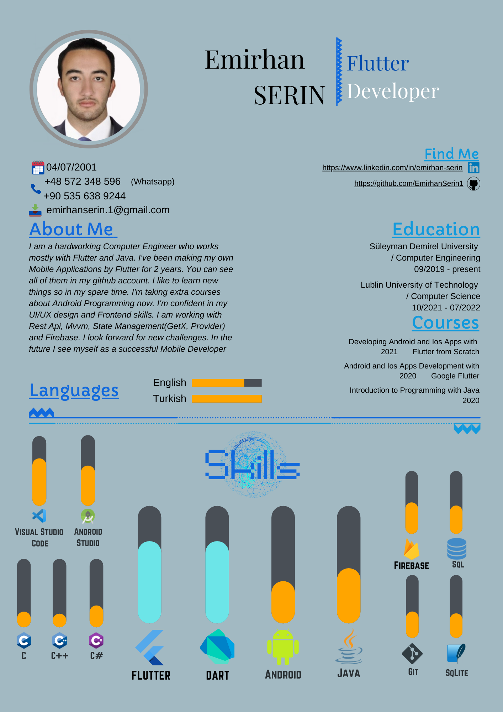
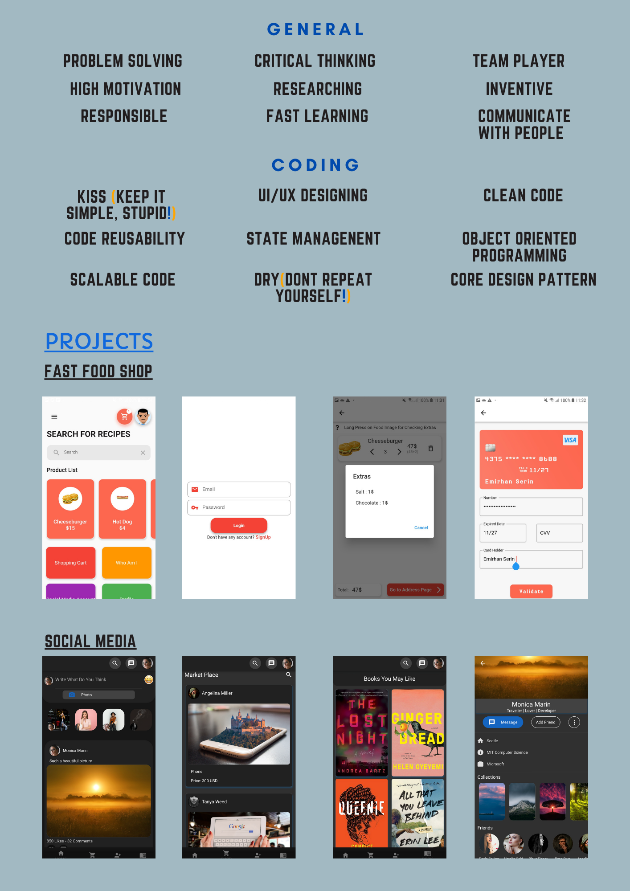

## Hi there, I’m Emirhan. 

- 🎓 I'm studying computer engineering and I am a Junior Flutter Developer.  
- 🏙 I'm from Turkey but I am living and studying in Poland.
- 💼 I'm currently interested in Flutter, Android and Java.
- I like to improve myself and I am improving myself everytime.

## Connect with me:

[][instagram]

[][linkedin]

[][twitter]

 

[instagram]: https://www.instagram.com/emirhansern
[linkedin]: https://www.linkedin.com/in/emirhan-serin
[twitter]: https://twitter.com/EmirhanSerinn

## 📊 GitHub Stats 

  
  

