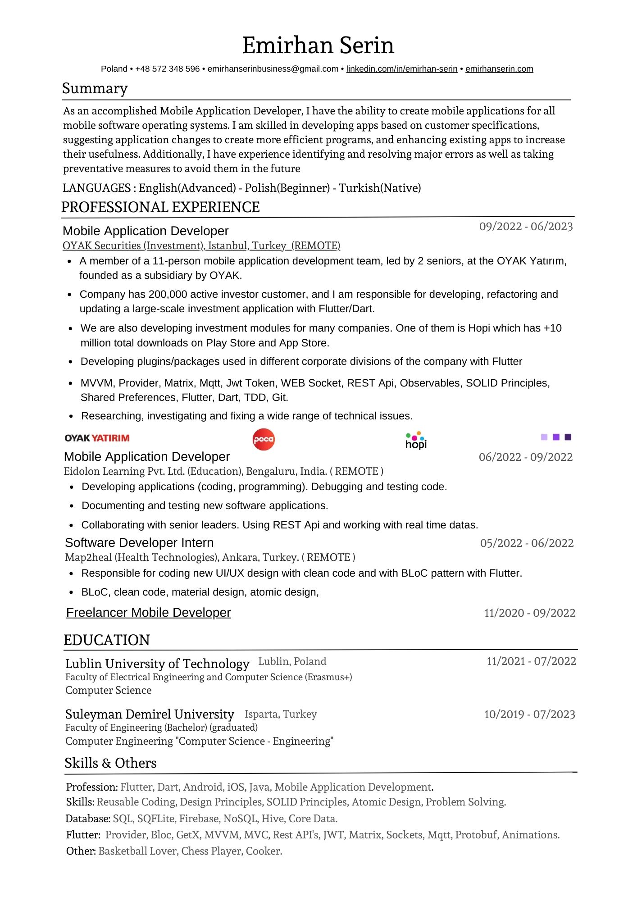
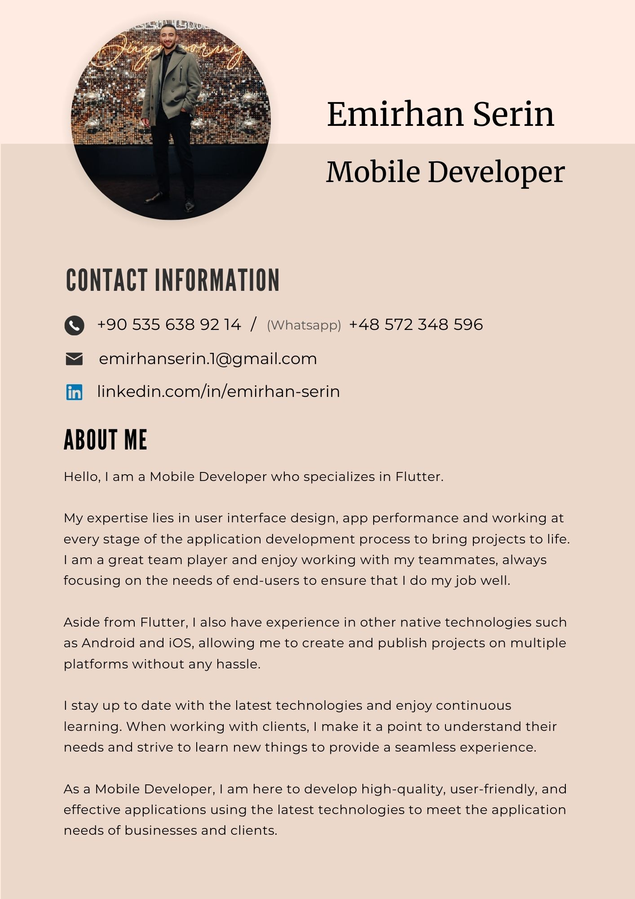

## Hi there, I’m Emirhan. 

Hello, I am a Mobile Developer who specializes in Flutter.

My expertise lies in user interface design, app performance and working at every stage of the application development process to bring projects to life. I am a great team player and enjoy working with my teammates, always focusing on the needs of end-users to ensure that I do my job well.

Aside from Flutter, I also have experience in other native technologies such as Android and iOS, allowing me to create and publish projects on multiple platforms without any hassle.

I stay up to date with the latest technologies and enjoy continuous learning. When working with clients, I make it a point to understand their needs and strive to learn new things to provide a seamless experience.

As a Mobile Developer, I am here to develop high-quality, user-friendly, and effective applications using the latest technologies to meet the application needs of businesses and clients.

## Connect with me:

[][instagram]

[][linkedin]

[][twitter]

 

[instagram]: https://www.instagram.com/emirhansern
[linkedin]: https://www.linkedin.com/in/emirhan-serin
[twitter]: https://twitter.com/EmirhanSerinn

## 📊 GitHub Stats 

  
  

