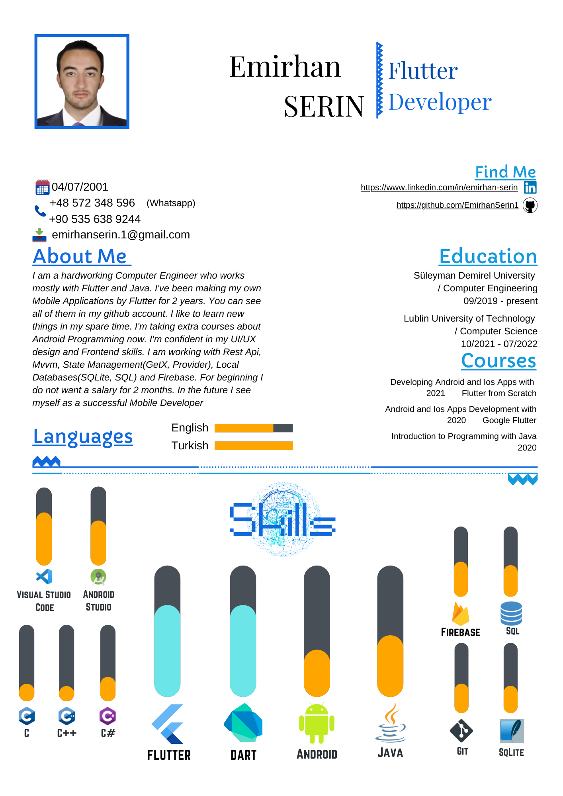

## Hi there, I’m Emirhan. 

- I'm calling myself as a Flutter Developer who works mostly with Flutter and Java. 
- I've been making my own Mobile Applications with Flutter for 2 years.
- I like to learn new things so in my spare time. I'm taking extra courses about Android Programming now.
- I'm confident in my UI/UX design and Frontend skills. I am working with Rest Api, Mvvm, State Management(GetX, Provider) and Firebase.
- I look forward for new challenges.
- In the future I see myself as a successful Mobile Developer

## Connect with me:

[][instagram]

[][linkedin]

[][twitter]

 

[instagram]: https://www.instagram.com/emirhansern
[linkedin]: https://www.linkedin.com/in/emirhan-serin
[twitter]: https://twitter.com/EmirhanSerinn

## 📊 GitHub Stats 

  
  

